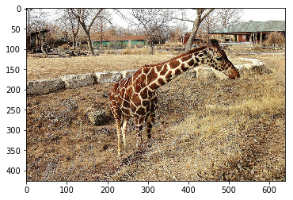
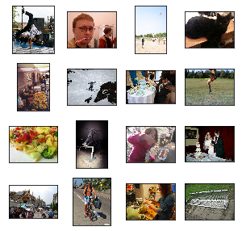
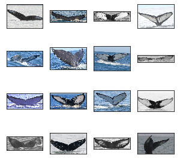

# 第6章  COCO API 的使用

COCO 数据库是由微软发布的一个大型图像数据集，该数据集专为对象检测、分割、人体关键点检测、语义分割和字幕生成而设计。如果你要了解 COCO 数据库的一些细节，你可以参考：

- MS COCO 数据集主页：http://mscoco.org/
- 我改写的 COCO API 网址：https://github.com/Xinering/cocoapi
- 数据下载: http://mscoco.org/dataset/#download

[COCO API](https://github.com/cocodataset/cocoapi)[^1] 提供了 Matlab, Python 和 Lua 的 API 接口。该 API 接口提供完整的图像标签数据的加载，解析和可视化的工作。此外，网站还提供了与数据相关的文章，教程等。

[^1]: https://github.com/cocodataset/cocoapi

在使用 COCO 数据库提供的 API 和 demo 之前，我们首先需要下载 COCO 的图像和标签数据：

- 图像数据下载到 `coco/images/` 文件夹中
- 标签数据下载到 `coco/annotations/` 文件夹中

本章快报：

- 介绍和使用官方 API：详细说明如何在 Linux 和 Windows 系统下使用 cocoapi
- 改写官方 API：利用 Python 的特性对 API 进行改写，同时支持直接读取压缩文件
- API 扩展：将 API 推广至其他数据集

下面我们来探讨一下如何利用 Python 来使用 COCO 数据集？

## 6.1  COCO API 的配置与简介

为了方便操作，我们先 fork 官方 [COCO API](https://github.com/cocodataset/cocoapi)，然后下载到本地，并切换到 API 所在目录，如 `D:\API\cocoapi\PythonAPI`。

```sh
cd D:\API\cocoapi\PythonAPI
```

打开当前目录下的 [Makefile](https://github.com/Xinering/cocoapi/blob/master/PythonAPI/Makefile) 可以看到 API 的安装和使用说明。

### 6.1.1  Windows 的配置

在 Windows 下直接运行 `python setup.py build_ext --inplace` 会报错：


Windows 中 （一般需要安装 visual studio）有许多的坑，参考 [Windows 10 编译 Pycocotools 踩坑记](https://www.jianshu.com/p/de455d653301)[^2] 暴力删掉参数 `Wno-cpp` 和 `Wno-unused-function`，如下图所示：


[^2]: https://www.jianshu.com/p/de455d653301

这样，我们便可以在 Python 中使用 `pycocotools`，不过每次你想要调用 `pycocotools` 需要先载入局部环境：

```python
import sys
sys.path.append('D:\API\cocoapi\PythonAPI')   # 将你的 `pycocotools` 所在路径添加到系统环境
```

如果你不想这么麻烦，你可以直接将 `pycocotools` 安装在你的主环境下：

```sh
cd D:\API\cocoapi\PythonAPI

python setup.py build_ext install
rd build   # 删除
```

但是，这样并没有解决根本问题，还有许多 bug 需要你自己调，因而在第 6.2 节 介绍了 cocoapi 对 Windows 系统更加的友好实现。

### 6.1.2  Linux 下的配置

在 Linux 下，不需要上面这么多编译步骤，我们直接在终端输入下列命令即可正常使用 COCO API：

```sh
pip3 install -U Cython
pip3 install -U pycocotools
```

当然，你也可以使用和 Windows 系统同样的处理方法，具体操作方法也可以参考 [Makefile](https://github.com/Xinering/cocoapi/blob/master/PythonAPI/Makefile)[^3]。

[^3]: https://github.com/Xinering/cocoapi/blob/master/PythonAPI/Makefile

### 6.1.3 API 简介

[COCO API](https://github.com/Xinering/cocoapi) 可以帮助你载入、解析和可视化 annotations。 该 API 支持 multiple annotation 格式 (详情见 [data format](http://cocodataset.org/#format-data)[^4]). 更多关于 API 的细节可参考 [coco.py](https://github.com/Xinering/cocoapi/blob/master/PythonAPI/pycocotools/coco.py)[^5]，同时 [Python API demo](https://github.com/Xinering/cocoapi/blob/master/PythonAPI/pycocoDemo.ipynb)[^6] 也提供了API 的英文使用说明。

[^4]: http://cocodataset.org/#format-data

[^5]: https://github.com/Xinering/cocoapi/blob/master/PythonAPI/pycocotools/coco.py

[^6]: https://github.com/Xinering/cocoapi/blob/master/PythonAPI/pycocoDemo.ipynb

下面从官方页面截了张 COCO API 的记号说明的图片：


COCO 还为每个实例对象提供了分割掩码（segmentation masks），但是产生了两个挑战：紧凑地存储掩码和高效地执行掩码计算。 MASK API 使用自定义运行长度编码 (Run Length Encoding, RLE) 方案解决这两个难题。RLE 表示的大小与掩码的边界像素数成正比，并且可以在 RLE 上直接有效地计算操作 (如面积、联合或交集)。具体来说，假设 shapes 相当简单, RLE 表示形式为 $O(\sqrt{n})$, 其中 $n$ 是对象中的像素数, 而通常计算量同样是 $O(\sqrt{n})$。在解码掩码 (存储为阵列) 上进行相同操作的自然的计算量将是 $O(n)$。[^4]

Mask API 提供了一个用于操作以 RLE 格式存储的掩码的接口。这个 API 被定义在 [mask.py](https://github.com/Xinering/cocoapi/blob/master/PythonAPI/pycocotools/mask.py)[^7]。最后, 大多数 ground truth masks 存储为多边形 (相当紧凑), 这些多边形在需要时转换为 RLE。


[^7]: https://github.com/Xinering/cocoapi/blob/master/PythonAPI/pycocotools/mask.py

至此，cocoapi 的介绍便宣告结束了，具体使用细则可以参考[pycocoDemo.ipynb](https://github.com/Xinering/cocoapi/blob/master/PythonAPI/pycocoDemo.ipynb)[^8] 提供的 cocoapi 的使用 demo，我已经翻译成中文，大家可以查阅：[COCO 数据集的使用](https://www.cnblogs.com/q735613050/p/8969452.html)[^9]。

[^8]: https://github.com/Xinering/cocoapi/blob/master/PythonAPI/pycocoDemo.ipynb
[^9]: https://www.cnblogs.com/q735613050/p/8969452.html

## 6.2  改写 COCO API 的初衷

前文我一直在说 cocoapi 对 Windows 系统不友好，相信在 Windows 系统下使用过 cocoapi 的朋友一定会十分赞同的。

### 6.2.1  Why? API 改写的目的

为了在 Windows 系统下更加友好的使用 cocoapi，抛去各种调 bug 的烦恼，我们十分有必要对 cocoapi 进行改写。但是，完全改写源码是有点让人感到恐惧的事情，而 Python 是一个十分强大的语言，我们利用它的继承机制可以无压力改写代码。

### 6.2.2  What? API 可以做什么

读者朋友是不是感觉改写 API 在做无用功，我们直接在 Linux 系统使用 cocoapi 也没有这么多的烦恼，为什么一定要改写？因为，改写后的 API 除了可以直接在 Windows 系统友好使用之外，它还提供了无需解压（直接跳过解压）直接获取标注信息和图片的功能。

### 6.2.3  How? API 如何设计

我们在 cocoapi 所在目录 `D:\API\cocoapi\PythonAPI\pycocotools` 下创建 `cocoz.py` 文件。下面我们来一步一步的填充 `cocoz.py`。为了方便调试，我们先在 Notebook 模式下设计该 API，设计好之后，我们再封装到 `cocoz.py` 文件中。为了令 cocoapi 可以使用，需要先载入环境：

```python
import sys
sys.path.append(r'D:\API\cocoapi\PythonAPI')

from pycocotools.coco import COCO
```

由于我们需要直接读取压缩文件，因而我们需要 `zipfile`，为了减少代码编写的工作量，我们直接借用 cocoapi 的 `COCO` 类。又因为标注信息是以 `.json` 形式存储的，所以载入 `json` 也是必要的，而 `numpy` 和 `cv2` 处理图片数据的重要工具当然也需要。

```python
import os
import zipfile
import numpy as np
import cv2
import json
import time
```

为了更加方便的查看某个函数运行时间，我们需要一个计时器：

```python
def timer(func):
    '''
    Define a timer, pass in one, and
    return another method with the timing feature attached
    '''
    def wrapper(*args):
        start = time.time()
        print('Loading json in memory ...')
        value = func(*args)
        end = time.time()
        print('used time: {0:g} s'.format(end - start))
        return value

    return wrapper
```

我将 COCO 的所有数据都下载到了磁盘，我们可以查看如下：

```python
root = r'E:\Data\coco'   # COCO 数据根目录

dataDir = os.path.join(root, 'images')  #  图片所在目录
annDir = os.path.join(root, 'annotations')  # 标注信息所在目录

print('images:\n',os.listdir(dataDir))
print('='*50)
print('annotations:\n',os.listdir(dataDir))
print(os.listdir(annDir))
```

输出结果：

    images:
    ['test2014.zip', 'test2015.zip', 'test2017.zip', 'train2014.zip', 'train2017.zip', 'unlabeled2017.zip', 'val2014.zip', 'val2017.zip']
    ==================================================
    annotations:
    ['test2014.zip', 'test2015.zip', 'test2017.zip', 'train2014.zip', 'train2017.zip', 'unlabeled2017.zip', 'val2014.zip', 'val2017.zip']
    ['annotations_trainval2014.zip', 'annotations_trainval2017.zip', 'image_info_test2014.zip', 'image_info_test2015.zip', 'image_info_test2017.zip', 'image_info_unlabeled2017.zip', 'panoptic_annotations_trainval2017.zip', 'stuff_annotations_trainval2017.zip']

可以看出：所有数据我都没有解压，下面我们将动手设计一个无需解压便可获取数据信息的接口。

## 6.3  ImageZ 的设计和使用


我们先设计一个用来处理 `coco/images/` 文件夹下的图片数据集的类：

```python
class ImageZ(dict):
    '''
    Working with compressed files under the images
    '''

    def __init__(self, root, dataType, *args, **kwds):
        '''
        root:: root dir
        dataType in ['test2014', 'test2015',
                    'test2017', 'train2014',
                    'train2017', 'unlabeled2017',
                    'val2014', 'val2017']
        '''
        super().__init__(*args, **kwds)
        self.__dict__ = self
        self.shuffle = True if dataType.startswith('train') else False
        self.Z = self.__get_Z(root, dataType)
        self.names = self.__get_names(self.Z)
        self.dataType = self.Z.namelist()[0]

    @staticmethod
    def __get_Z(root, dataType):
        '''
        Get the file name of the compressed file under the images
        '''
        dataType = dataType + '.zip'
        img_root = os.path.join(root, 'images')
        return zipfile.ZipFile(os.path.join(img_root, dataType))

    @staticmethod
    def __get_names(Z):
        names = [
            name.split('/')[1] for name in Z.namelist()
            if not name.endswith('/')
        ]
        return names

    def buffer2array(self, image_name):
        '''
        Get picture data directly without decompression

        Parameters
        ===========
        Z:: Picture data is a ZipFile object
        '''
        image_name = self.dataType + image_name
        buffer = self.Z.read(image_name)
        image = np.frombuffer(buffer, dtype="B")  # 将 buffer 转换为 np.uint8 数组
        img_cv = cv2.imdecode(image, cv2.IMREAD_COLOR)  # BGR 格式
        img = cv2.cvtColor(img_cv, cv2.COLOR_BGR2RGB)
        return img
```

代码这么长看着是不是有点懵，具体细节大家自己琢磨，我们直接看看它有什么神奇之处？

```python
dataDir = r'E:\Data\coco'   # COCO 数据根目录
dataType = 'val2017'
imgZ = ImageZ(dataDir, dataType)
```

由于 `imgZ` 继承自 `dict`，所以它拥有字典的几乎所有属性和功能：

```python
imgZ.keys()
```

输出

    dict_keys(['shuffle', 'Z', 'names', 'dataType'])

- `names`：存储了 `val2017.zip` 的所有图片的文件名
- `shuffle`：判断是否是训练数据集
- `Z`：`ZipFile` 对象，用来操作整个 `val2017.zip` 文件

还有一个实例方法 `buffer2array` 可以直接通过图片的文件名获取其像素级特征。

```python
fname = imgZ.names[77]  # 一张图片的文件名
img = imgZ.buffer2array(fname)  # 获取像素级特征
```

由于 `img` 是 Numpy 数组，这样我们就可以对其进行各种我们熟悉的操作，如图片显示：

```python
from matplotlib import pyplot as plt

plt.imshow(img)
plt.show()
```

输出：



至此，我们已经完成无需解压直接读取图片的工作。

## 6.4  AnnZ 的设计和使用

代码如下：

```python
class AnnZ(dict):
    '''
    Working with compressed files under annotations
    '''

    def __init__(self, root, annType, *args, **kwds):
        '''
        dataType in [
              'annotations_trainval2014',
              'annotations_trainval2017',
              'image_info_test2014',
              'image_info_test2015',
              'image_info_test2017',
              'image_info_unlabeled2017',
              'panoptic_annotations_trainval2017',
              'stuff_annotations_trainval2017'
        ]
        '''
        super().__init__(*args, **kwds)
        self.__dict__ = self
        self.Z = self.__get_Z(root, annType)
        self.names = self.__get_names(self.Z)

    @staticmethod
    def __get_Z(root, annType):
        '''
        Get the file name of the compressed file under the annotations
        '''
        annType = annType + '.zip'
        annDir = os.path.join(root, 'annotations')
        return zipfile.ZipFile(os.path.join(annDir, annType))

    @staticmethod
    def __get_names(Z):
        names = [name for name in Z.namelist() if not name.endswith('/')]
        return names

    @timer
    def json2dict(self, name):
        with self.Z.open(name) as fp:
            dataset = json.load(fp)
        return dataset
```

我们直接看看如何使用？

```python
root = r'E:\Data\coco'   # COCO 数据集所在根目录
annType = 'annotations_trainval2017'   # COCO 标注数据类型

annZ = AnnZ(root, annType)
```

我们来查看一下，该标注数据所包含的标注种类：

```python
annZ.names
```

输出：

    ['annotations/instances_train2017.json',
     'annotations/instances_val2017.json',
     'annotations/captions_train2017.json',
     'annotations/captions_val2017.json',
     'annotations/person_keypoints_train2017.json',
     'annotations/person_keypoints_val2017.json']

下面以 `dict` 的形式载入 'annotations/instances_train2017.json' 的具体信息：

```python
annFile = 'annotations/instances_val2017.json'
dataset = annZ.json2dict(annFile)
```

输出：

    Loading json in memory ...
    used time: 1.052 s

我们还可以查看 `dataset` 的关键字：

```python
dataset.keys()
```

输出：

    dict_keys(['info', 'licenses', 'images', 'annotations', 'categories'])

这样，我们可以很方便的使用 `dict` 的相关操作获取我们想要的一些信息：

```python
dataset['images'][7]  # 查看一张图片的一些标注信息
```

输出：

    {'license': 6,
    'file_name': '000000480985.jpg',
    'coco_url': 'http://images.cocodataset.org/val2017/000000480985.jpg',
    'height': 500,
    'width': 375,
    'date_captured': '2013-11-15 13:09:24',
    'flickr_url': 'http://farm3.staticflickr.com/2336/1634911562_703ff01cff_z.jpg',
    'id': 480985}

我们可以利用 `'coco_url'` 直接从网上获取图片：

```python
from matplotlib import pyplot as plt
import skimage.io as sio

coco_url = dataset['images'][7]['coco_url']
# use url to load image
I = sio.imread(coco_url)
plt.axis('off')
plt.imshow(I)
plt.show()
```

输出：


借助 ImageZ 从本地读取图片：

```python
from matplotlib import pyplot as plt
imgType = 'val2017'
imgZ = ImageZ(root, imgType)

I = imgZ.buffer2array(dataset['images'][100]['file_name'])

plt.axis('off')
plt.imshow(I)
plt.show()
```

输出：


## 6.5 COCOZ 的设计和使用

ImageZ 和 AnnZ 虽然很好用，但是它们的灵活性太大，并且现在的开源代码均是基于 COCO 类进行设计的。为了更加契合 cocoapi 我们需要一个中转类 COCOZ 去实现和 COCO 几乎一样的功能，并且使用方法也尽可能的保留。具体是代码如下：

```python
class COCOZ(COCO, dict):
    def __init__(self, annZ, annFile, *args, **kwds):
        '''
        ptint(coco):: View Coco's Instance object Coco's 'info'

        example
        ==========
        annZ = AnnZ(annDir, annType)
        '''
        super().__init__(*args, **kwds)
        self.__dict__ = self
        self.dataset = annZ.json2dict(annFile)
        self.createIndex()

    @timer
    def createIndex(self):
        # create index
        print('creating index...')
        cats, anns, imgs = {}, {}, {}
        imgToAnns, catToImgs = {}, {}
        if 'annotations' in self.dataset:
            for ann in self.dataset['annotations']:
                imgToAnns[ann['image_id']] = imgToAnns.get(
                    ann['image_id'], []) + [ann]
                anns[ann['id']] = ann
        if 'images' in self.dataset:
            for img in self.dataset['images']:
                imgs[img['id']] = img
        if 'categories' in self.dataset:
            for cat in self.dataset['categories']:
                cats[cat['id']] = cat
        if 'annotations' in self.dataset and 'categories' in self.dataset:
            for ann in self.dataset['annotations']:
                catToImgs[ann['category_id']] = catToImgs.get(
                    ann['category_id'], []) + [ann['image_id']]

        print('index created!')

        # create class members
        self.anns = anns
        self.imgToAnns = imgToAnns
        self.catToImgs = catToImgs
        self.imgs = imgs
        self.cats = cats

    def __str__(self):
        """
        Print information about the annotation file.
        """
        S = [
            '{}: {}'.format(key, value)
            for key, value in self.dataset['info'].items()
        ]
        return '\n'.join(S)
```

我们直接看看如何使用 COCOZ？

```python
root = r'E:\Data\coco'   # COCO 数据集所在根目录
annType = 'annotations_trainval2017'   # COCO 标注数据类型
annFile = 'annotations/instances_val2017.json'

annZ = AnnZ(root, annType)
coco = COCOZ(annZ, annFile)
```

输出：

    Loading json in memory ...
    used time: 1.036 s
    Loading json in memory ...
    creating index...
    index created!
    used time: 0.421946 s

如果你需要预览你载入的 COCO 数据集，可以使用 `print()` 来实现：

```python
print(coco)
```

输出：

    description: COCO 2017 Dataset
    url: http://cocodataset.org
    version: 1.0
    year: 2017
    contributor: COCO Consortium
    date_created: 2017/09/01

再次查看：

```python
coco.keys()
```

输出：

    dict_keys(['dataset', 'anns', 'imgToAnns', 'catToImgs', 'imgs', 'cats'])

### 6.5.1  展示 COCO 的类别与超类

```python
cats = coco.loadCats(coco.getCatIds())
nms = set([cat['name'] for cat in cats])  # 获取 cat 的 name 信息
print('COCO categories: \n{}\n'.format(' '.join(nms)))
# ============================================================
snms = set([cat['supercategory'] for cat in cats])  # 获取 cat 的 name 信息
print('COCO supercategories: \n{}'.format(' '.join(snms)))
```

输出：

    COCO categories:
    kite sports ball horse banana toilet mouse frisbee bed donut clock sheep keyboard tv cup elephant cake potted plant snowboard train zebra fire hydrant handbag cow wine glass bowl sink parking meter umbrella giraffe suitcase skis surfboard stop sign bear cat chair traffic light fork truck orange carrot broccoli couch remote hair drier sandwich laptop tie person tennis racket apple spoon pizza hot dog bird refrigerator microwave scissors backpack airplane knife baseball glove vase toothbrush book bottle motorcycle bicycle car skateboard bus dining table cell phone toaster boat teddy bear dog baseball bat bench oven

    COCO supercategories:
    animal kitchen food appliance indoor accessory person sports furniture outdoor electronic vehicle

### 6.5.2  通过给定条件获取图片

获取包含给定类别的所有图片

```python
# get all images containing given categories, select one at random
catIds = coco.getCatIds(catNms=['cat', 'dog', 'snowboar'])  # 获取 Cat 的 Ids
imgIds = coco.getImgIds(catIds=catIds )  # 
img = coco.loadImgs(imgIds)
# 随机选择一张图片的信息
img = coco.loadImgs(imgIds[np.random.randint(0,len(imgIds))])[0]

img
```

输出：

    {'license': 3,
    'file_name': '000000179392.jpg',
    'coco_url': 'http://images.cocodataset.org/val2017/000000179392.jpg',
    'height': 640,
    'width': 480,
    'date_captured': '2013-11-18 04:07:31',
    'flickr_url': 'http://farm5.staticflickr.com/4027/4329554124_1ce02506f8_z.jpg',
    'id': 179392}

### 6.5.3  将图片的 anns 信息标注在图片上

先从本地磁盘获取一张图片：

```python
from matplotlib import pyplot as plt
imgType = 'val2017'
imgZ = ImageZ(root, imgType)

I = imgZ.buffer2array(dataset['images'][55]['file_name'])

plt.axis('off')
plt.imshow(I)
plt.show()
```

输出：


将标注信息加入图片：

```python
# load and display instance annotations
plt.imshow(I)
plt.axis('off')
annIds = coco.getAnnIds(imgIds=img['id'], catIds=catIds, iscrowd=None)
anns = coco.loadAnns(annIds)
coco.showAnns(anns)
```

输出：


### 6.5.4  关键点检测

载入标注信息：

```python
# initialize COCO api for person keypoints annotations
root = r'E:\Data\coco'   # COCO 数据集所在根目录
annType = 'annotations_trainval2017'   # COCO 标注数据类型
annFile = 'annotations/person_keypoints_val2017.json'

annZ = AnnZ(root, annType)
coco_kps = COCOZ(annZ, annFile)
```

输出：

    Loading json in memory ...
    used time: 0.924155 s
    Loading json in memory ...
    creating index...
    index created!
    used time: 0.378003 s

先选择一张带有 person 的图片：

```python
from matplotlib import pyplot as plt

catIds = coco.getCatIds(catNms=['person'])  # 获取 Cat 的 Ids
imgIds = coco.getImgIds(catIds=catIds)  
img = coco.loadImgs(imgIds)[99]
# use url to load image
I = sio.imread(img['coco_url'])
plt.axis('off')
plt.imshow(I)
plt.show()
```

输出：


将标注加到图片上：

```python
# load and display keypoints annotations
plt.imshow(I); plt.axis('off')
ax = plt.gca()
annIds = coco_kps.getAnnIds(imgIds=img['id'], catIds=catIds, iscrowd=None)
anns = coco_kps.loadAnns(annIds)
coco_kps.showAnns(anns)
```

输出：


### 6.5.5  看图说话

载入标注信息：

```python
# initialize COCO api for person keypoints annotations
root = r'E:\Data\coco'   # COCO 数据集所在根目录
annType = 'annotations_trainval2017'   # COCO 标注数据类型
annFile = 'annotations/captions_val2017.json'

annZ = AnnZ(root, annType)
coco_caps = COCOZ(annZ, annFile)
```

输出

    Loading json in memory ...
    used time: 0.0760329 s
    Loading json in memory ...
    creating index...
    index created!
    used time: 0.0170002 s

将标注加到图片上：

    A man riding on a skateboard on the sidewalk.
    a kid riding on a skateboard on the cement
    There is a skateboarder riding his board on the sidewalk
    A skateboarder with one fut on a skateboard raising it up.
    A pavement where a person foot are seen having skates.


至此，我们已经完成了我们的预期目标。

## 6.6  让 API 更加通用

虽然我们完成了预期目标，但是 `cocoz.py` 还有很大的改进余地。比如我们可以令 ImageZ 变得像列表一样，支持索引和切片。为了优化结构，我们可以将其封装为生成器。基于这些想法我们便得到一个改进的 ImageZ，只需添加几个实例方法即可：

```python
def __getitem__(self, item):
    names = self.names[item]
    if isinstance(item, slice):
        return [self.buffer2array(name) for name in names]
    else:
        return self.buffer2array(names)


def __len__(self):
    return len(self.names)


def __iter__(self):
    for name in self.names:
        yield self.buffer2array(name)
```

详细代码被我放在：[cocoz.py](https://github.com/Xinering/cocoapi/blob/master/PythonAPI/pycocotools/cocoz.py)[^10]。

[^10]: https://github.com/Xinering/cocoapi/blob/master/PythonAPI/pycocotools/cocoz.py

同时，为了令其他数据也可以使用 ImageZ 类，我们将 `ImageZ` 的输入参数改为 images 所在路径，其他不变。由于我们已经将上述的 ImageZ、AnnZ、COCOZ 封装进了 `cocoz.py`，所以下面我们可以直接调用它们：

```python
import sys

# 将 cocoapi 添加进入环境变量
sys.path.append(r'D:\API\cocoapi\PythonAPI')

from pycocotools.cocoz import AnnZ, ImageZ, COCOZ
```

为了避免重复，下面我们查看一张 `train2017,zip` 的图片：

```python
dataDir = r'E:\Data\coco\images'   # COCO 数据根目录
dataType = 'train2017'
imgZ = ImageZ(dataDir, dataType)
```

下面我们通过索引的方式查看：

```python
from matplotlib import pyplot as plt

img = imgZ[78]
plt.imshow(img)
plt.show()
```

显示如下：


我们也可以通过切片的方式获取多张图片，为了可视化的方便，我们先定义一个用来可视化的函数：

```python
from IPython import display
from matplotlib import pyplot as plt


def use_svg_display():
    # 用矢量图显示, 效果更好
    display.set_matplotlib_formats('svg')


def show_imgs(imgs, is_first_channel=False):
    '''
    展示 多张图片
    '''
    if is_first_channel:
        imgs = imgs.transpose((0, 2, 3, 1))
    n = len(imgs)
    h, w = 4, int(n / 4)
    use_svg_display()
    _, ax = plt.subplots(h, w, figsize=(5, 5))  # 设置图的尺寸
    K = np.arange(n).reshape((h, w))
    for i in range(h):
        for j in range(w):
            img = imgs[K[i, j]]
            ax[i][j].imshow(img)
            ax[i][j].axes.get_yaxis().set_visible(False)
            ax[i][j].set_xticks([])
    plt.show()
```

下面我们看看其中的 16 张图片：

```python
show_imgs(imgZ[100:116])
```

显示结果如下：



到目前为此，我们都是仅仅关注了 COCO 数据集，而 ImageZ 不仅仅可以处理 COCO 数据集，它也能处理其它以 `.zip` 形式压缩的数据集，比如 Kaggle 上的一个比赛 [Humpback Whale Identification](https://www.kaggle.com/c/humpback-whale-identification)[^11] 提供的关于座头鲸的数据集。该数据集大小为 5G 左右，如果直接解压然后再处理也是很麻烦，我们可以直接使用 ImageZ 来读取图片。

首先，我们先将下载好的 `all.zip` 进行解压：

```python
import zipfile
import os

dataDir = r'E:\Data\Kaggle'

fname = 'all.zip'

with zipfile.ZipFile(os.path.join(dataDir, fname)) as z:
    z.extractall(os.path.join(dataDir, 'HumpbackWhale'))
```

[^11]: https://www.kaggle.com/c/humpback-whale-identification

解压好之后，我们查看一下该数据集的组成：

```python
dataDir = r'E:\Data\Kaggle\HumpbackWhale'

os.listdir(dataDir)
```

输出：

    ['sample_submission.csv', 'test.zip', 'train.csv', 'train.zip']

可以看出：该数据集有图片数据集 `'test.zip'` 与 `'train.zip'`。这样我们直接借助 ImageZ 来读取图片：

```python
dataDir = r'E:\Data\Kaggle\HumpbackWhale'
dataType = 'train'
imgZ = ImageZ(dataDir, dataType)
```

我们也看看其中的 16 张图片：

```python
show_imgs(imgZ[100:116])
```

显示：



## 6.7  小节

本章主要介绍了 COCO 数据及其 API cocoapi ，同时为了更好的使用 cocoapi，又自制了一个可以直接读取 `.zip` 数据集的接口 `cocoz.py`。同时，`cocoz.py` 也可以用来直接读取以 COCO 标注数据形式封装的其他数据集。