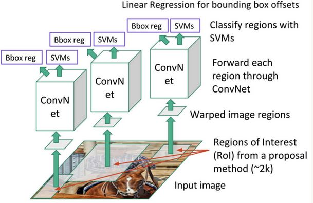
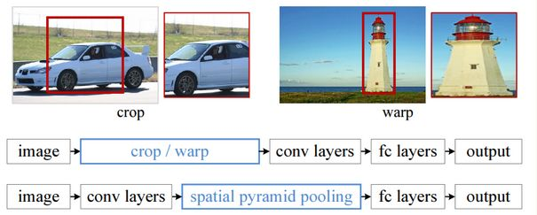
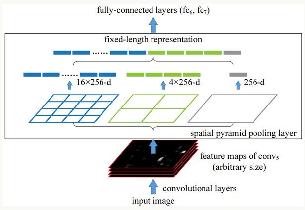
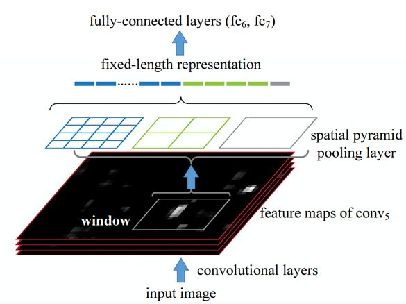
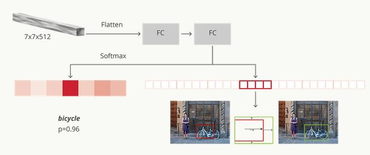
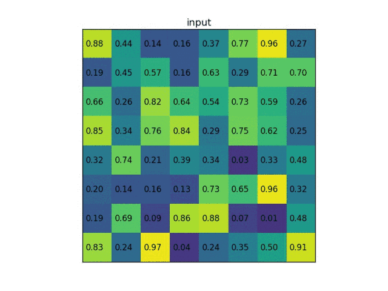
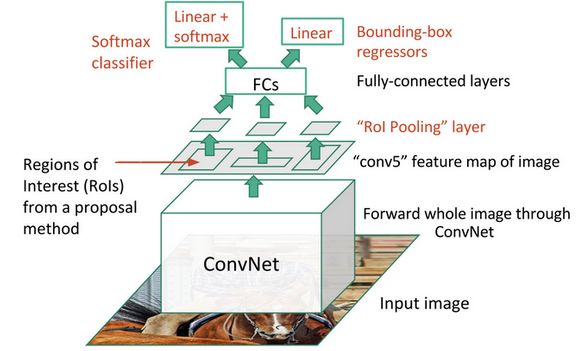
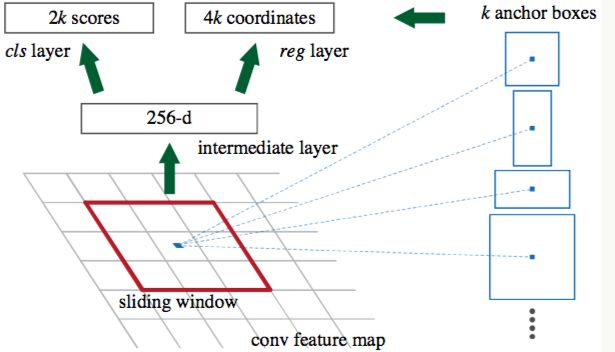
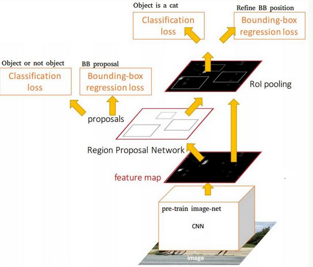

参考：[l7H9JA4](https://blog.csdn.net/l7H9JA4/article/details/79620247)

目标检测常用的数据集包括 PASCAL VOC，ImageNet，MS COCO 等数据集，这些数据集用于研究者测试算法性能或者用于竞赛。目标检测的性能指标要考虑检测物体的位置以及预测类别的准确性，下面我们会说到一些常用的性能评估指标。

#### 1.11.1 数据集

1. 数据集 PASCAL VOC（[The PASCAL Visual Object Classification](http://host.robots.ox.ac.uk/pascal/VOC/)）是目标检测，分类，分割等领域一个有名的数据集。从2005到2012年，共举办了8个不同的挑战赛。PASCAL VOC包含约10,000张带有边界框的图片用于训练和验证。但是，PASCAL VOC数据集仅包含20个类别，因此其被看成目标检测问题的一个基准数据集。
2. [ImageNet](http://www.image-net.org/)在2013年放出了包含边界框的目标检测数据集。训练数据集包含500,000张图片，属于200类物体。由于数据集太大，训练所需计算量很大，因而很少使用。同时，由于类别数也比较多，目标检测的难度也相当大。2014 ImageNet数据集和2012 PASCAL VOC数据集的对比在[这里](http://image-net.org/challenges/LSVRC/2014/)。
3. Microsoft公司（见[T.-Y.Lin and al. 2015](https://arxiv.org/pdf/1405.0312.pdf))建立的 MS COCO（[Common Objects in COntext](http://cocodataset.org/#home)）数据集用于多种竞赛：图像标题生成，目标检测，关键点检测和物体分割。对于目标检测任务，COCO共包含80个类别，每年大赛的训练和验证数据集包含超过120,000个图片，超过40,000个测试图片。测试集最近被划分为两类，一类是test-dev数据集用于研究者，一类是test-challenge数据集用于竞赛者。测试集的标签数据没有公开，以避免在测试集上过拟合。在[COCO 2017 Detection Challenge](http://cocodataset.org/#detections-challenge2017)中，旷视科技团队凭借提出的[Light-Head R-CNN](https://arxiv.org/pdf/1711.07264.pdf)模型夺得冠军（AP为0.526），看来还是 two-stage 算法准确度更胜一筹。

#### 1.11.2 性能指标

目标检测问题同时是一个回归和分类问题。首先，为了评估定位精度，需要计算IoU（Intersection over Union，介于0到1之间），其表示预测框与真实框（ground-truth box）之间的重叠程度。IoU越高，预测框的位置越准确。因而，在评估预测框时，通常会设置一个IoU阈值（如0.5），只有当预测框与真实框的IoU值大于这个阈值时，该预测框才被认定为真阳性（True Positive, TP），反之就是假阳性（False Positive，FP）。对于二分类，AP（Average Precision）是一个重要的指标，这是信息检索中的一个概念，基于precision-recall曲线计算出来。对于目标检测，首先要单独计算各个类别的AP值，这是评估检测效果的重要指标。取各个类别的AP的平均值，就得到一个综合指标mAP（Mean Average Precision），mAP指标可以避免某些类别比较极端化而弱化其它类别的性能这个问题。对于目标检测，mAP一般在某个固定的IoU上计算，但是不同的IoU值会改变TP和FP的比例，从而造成mAP的差异。COCO数据集提供了[官方的评估指标](https://github.com/cocodataset/cocoapi)， 它的 AP 是计算一系列IoU下（0.5:0.05:0.9，见(http://cocodataset.org/#detection-eval)）AP的平均值，这样可以消除IoU导致的AP波动。其实对于PASCAL VOC数据集也是这样，Facebook 的 Detectron上的有比较清晰的[实现](https://github.com/facebookresearch/Detectron/blob/05d04d3a024f0991339de45872d02f2f50669b3d/lib/datasets/voc_eval.py#L54)。

除了检测准确度，目标检测算法的另外一个重要性能指标是速度，只有速度快，才能实现实时检测，这对一些应用场景极其重要。评估速度的常用指标是每秒帧率（Frame Per Second，FPS），即每秒内可以处理的图片数量。当然要对比 FPS，你需要在同一硬件上进行。另外也可以使用处理一张图片所需时间来评估检测速度，时间越短，速度越快。

### 3 R-CNNR-CNN

（[R. Girshick et al., 2014](http://islab.ulsan.ac.kr/files/announcement/513/rcnn_pami.pdf)）是基于region proposal方法的目标检测算法系列开山之作，其先进行区域搜索，然后再对候选区域进行分类。在R-CNN中，选用Selective search方法(http://www.huppelen.nl/publications/selectiveSearchDraft.pdf)来生成候选区域，这是一种启发式搜索算法。它先通过简单的区域划分算法将图片划分成很多小区域，然后通过层级分组方法按照一定相似度合并它们，最后的剩下的就是候选区域（region proposals），它们可能包含一个物体。上面是分割结果，下面是候选框. 来源: J.R.R. Uijlings and al. (2012)对于一张图片，R-CNN基于selective search方法大约生成2000个候选区域，然后每个候选区域被resize成固定大小（$227\times 227$）并送入一个CNN模型中，最后得到一个4096-d的特征向量。然后这个特征向量被送入一个多类别SVM分类器中，预测出候选区域中所含物体的属于每个类的概率值。每个类别训练一个SVM分类器，从特征向量中推断其属于该类别的概率大小。为了提升定位准确性，R-CNN最后又训练了一个边界框回归模型。训练样本为$(P, G)$，其中$P=(P_x, P_y, P_w, P_h)$为候选区域，而$G=(G_x, G_y, G_w, G_h)$为真实框，$G$是与$P$的IoU最大的真实框（只使用IoU大于0.6的样本），回归器的目标值定义为：

$$
t_x = \frac{G_x - P_x}{P_w}\\
t_y = \frac{G_y - P_x}{P_y}\\
t_w = \log \frac{G_w}{P_w}\\
t_h = \log \frac{G_h}{P_h}
$$

在做预测时，利用上述公式可以反求出预测框的修正位置。R-CNN 对每个类别都训练了单独的回归器，采用最小均方差损失函数进行训练。

R-CNN 模型的训练是多管道的，CNN 模型首先使用 2012 ImageNet 中的图像分类竞赛数据集进行预训练。然后在检测数据集上对CNN模型进行finetuning，其中那些与真实框的IoU大于0.5的候选区域作为正样本，剩余的候选区域是负样本（背景）。共训练两个版本，第一版本使用2012 PASCAL VOC数据集，第二个版本使用2013 ImageNet中的目标检测数据集。最后，对数据集中的各个类别训练SVM分类器（注意SVM训练样本与CNN模型的funetuning不太一样，只有IoU小于0.3的才被看成负样本）。总体来看，R-CNN是非常直观的，就是把检测问题转化为了分类问题，并且采用了CNN模型进行分类，但是效果却很好。最好的R-CNN模型在2012 PASCAL VOC数据集的mAP为62.4%（比第二名高出了22个百分点），在2013 ImageNet上的mAP为31.4%（比第二名高出7.1个百分点）。

### SPP-net

SPP-net（[Spatial Pyramid Pooling in Deep Convolutional Networks for Visual Recognition, He et al. 2014](https://arxiv.org/pdf/1406.4729.pdf)）提出的起因是解决图像分类中要求输入图片固定大小的问题，但是SPP-net中所提出的空间金字塔池化层（Spatial Pyramid Pooling Layer, SPP）可以和R-CNN结合在一起并提升其性能。采用深度学习模型解决图像分类问题时，往往需要图像的大小固定（比如$224\times 224$），这并不是CNN层的硬性要求，主要原因在于CNN层提取的特征图最后要送入全连接层（如softmax层），对于变大小图片，CNN层得到的特征图大小也是变化的，但是全连接层需要固定大小的输入，所以必须要将图片通过resize, crop或wrap等方式固定大小（训练和测试时都需要）。但是实际上真实的图片的大小是各种各样的，一旦固定大小可能会造成图像损失，从而影响识别精度。为了解决这个问题，SSP-net在CNN层与全连接层之间插入了空间金字塔池化层来解决这个矛盾。

SPP层原理如下所所示，假定CNN层得到的特征图大小为$a\times a$（比如$13\times 13$，随输入图片大小而变化），设定的金字塔尺度为$n\times n$ bins（对于不同大小图片是固定的），那么SPP层采用一种滑动窗口池化，窗口大小$win\_size=\lceil a/n\rceil $，步为$stride=\lfloor a/n\rfloor $，采用max pooling，本质上将特征图均分为$n\times n$个子区域，然后对各个子区域max pooling，这样不论输入图片大小，经过SPP层之后得到是固定大小的特征。一般设置多个金字塔级别，文中使用了$4\times 4$，$2\times 2$和$1\times 1$三个尺度。每个金字塔都得一个特征，将它们连接在一起送入后面的全连接层即可，这样就解决了变大小图片输入的问题了。SPP-net在ImageNet ILSVRC 2014图像分类大赛中夺得了第三名。

那么SPP-net和R-CNN有什么关系呢？在R-CNN中，由于每个候选区域大小是不同，所以需要先resize成固定大小才能送入CNN网络，SPP-net正好可以解决这个问题。继续上前一步，就是R-CNN每次都要挨个使用CNN模型计算各个候选区域的特征，这是极其费时的，不如直接将整张图片送入CNN网络，然后抽取候选区域的对应的特征区域，采用SPP层，这样可以大大减少计算量，并提升速度。基于SPP层的R-CNN模型在准确度上提升不是很大，但是速度却比原始R-CNN模型快24-102倍。这也正是接下来Fast R-CNN所改进的方向。

### Fast R-CNN

Fast R-CNN（[Fast Region-based Convolutional Network, R. Girshick 2015](https://arxiv.org/pdf/1504.08083.pdf)）的提出主要是为了减少候选区域使用CNN模型提取特征向量所消耗的时间，其主要借鉴了SPP-net的思想。在R-CNN中，每个候选区域都要单独送入CNN模型计算特征向量，这是非常费时的，而对于Fast R-CNN，其CNN模型的输入是整张图片，然后结合RoIs（Region of Interests）pooling和Selective Search方法从CNN得到的特征图中提取各个候选区域的所对应的特征。对于每个候选区域，使用RoI pooling层来从CNN特征图中得到一个固定长和宽的特征图（长和宽是超参数，文中选用7* 7），RoI pooling的原理很简单，其根据候选区域按比例从CNN特征图中找到对应的特征区域，然后将其分割成几个子区域（根据要输出的特征图的大小），然后在每个子区域应用max pooling，从而得到固定大小的特征图，这个过程是可导的（见RoI pooling层的[Caffe官方实现](https://github.com/rbgirshick/caffe-fast-rcnn/blob/bcd9b4eadc7d8fbc433aeefd564e82ec63aaf69c/src/caffe/layers/roi_pooling_layer.cpp)，RoI pooling层在大部分深度学习框架中是没有官方实现的，需要自己扩展，Tensorflow上的开源实现可以参考[deepsense-ai/roi-pooling](https://github.com/deepsense-ai/roi-pooling)，但是在TensorFlow中可以基于一种crop+resize+pooling的方式，可以看一下[Luminoth上的实现](https://github.com/tryolabs/luminoth/blob/master/luminoth/models/fasterrcnn/roi_pool.py)），RoI pooling层相比SPP层看起来主要是只使用一个金字塔级别。然后RoI pooling层得到的特征图送入几个全连接层中，并产生新的特征向量，这些特征向量分别用于一个softmax分类器（预测类别）和一个线性回归器上（用于调整边界框位置）来进行检测。在实现上是使用两个不同的全连接层，第一个全连接层有N+1个输出（N是类别总数，1是背景），表示各个类别的概率值；第二个全连接层有4N个输出，表示坐标回归值(t_x, t_y, t_w, t_h)，这个与R-CNN是一样的，每个类别都预测4个位置坐标值。

Fast R-CNN与R-CNN的另外的一个主要区别点是采用了softmax分类器而不是SVM分类器，而且训练过程是单管道的，因为Fast R-CNN将分类误差和定位误差合并在一起训练，定位误差采用smooth L1 而不是R-CNN中的L2。这里说点题外话，就是R-CNN训练是多管道的，除了对CNN模型预训练，R-CNN还先对CNN模型funetuning，使用的是softmax分类器，但是最后却又训练SVM分类器（原因可以见原论文），直觉上感觉有点多此一举，所以现在Fast R-CNN直接采用softmax分类器了。Fast R-CNN训练采用mini-batch sampling，每个mini-batch大小为128，从N=2个图片中构建，其中25%来自正样本（IoU>=0.5）,75%从负样本中抽样得到（背景，IoU属于 [0.1,0.5)），这里的IoU阈值属于超参数。在图像分类中，当我们说batch_size=32时，是指的是32个图片，在Fast R-CNN中并不是这样，因为一个图片含有很多RoIs，每个batch使用的图片非常少（内存限制），所以有时候你会看到Fast R-CNN训练时直接从一个图片中构建batch，这实现起来更容易一些。

$$
L(p,u,t^u,v) = L_{cls}(p,u) + \lambda[u>0]L_{loc}(t^u,v)
$$

最好的Fast R-CNN模型在2007 PASCAL VOC测试集上的mAp为70%，在2010 PASCAL VOC测试集上的mAP为68.8%，而在2012 PASCAL VOC测试集上的mAP为68.4%，准确度相比R-CNN略有提升，其实主要是速度更快。

### Faster R-CNN

对于Fast R-CNN，其仍然需要selective search方法来生产候选区域，这是非常费时的。为了解决这个问题，Faster R-CNN模型（The Faster Region-based Convolutional Network, [S. Ren and al. 2016](https://arxiv.org/pdf/1506.01497.pdf)）引入了RPN (Region Proposal Network)直接产生候选区域。Faster R-CNN可以看成是RPN和Fast R-CNN模型的组合体，即Faster R-CNN = RPN + Fast R-CNN。对于RPN网络，先采用一个CNN模型（一般称为特征提取器）接收整张图片并提取特征图。然后在这个特征图上采用一个N* N（文中是3* 3）的滑动窗口，对于每个滑窗位置都映射一个低维度的特征（如256-d）。然后这个特征分别送入两个全连接层，一个用于分类预测，另外一个用于回归。对于每个窗口位置一般设置k个不同大小或比例的先验框（anchors, default bounding boxes），这意味着每个位置预测$k$个候选区域（region proposals）。对于分类层，其输出大小是2k，表示各个候选区域包含物体或者是背景的概率值，而回归层输出4k个坐标值，表示各个候选区域的位置（相对各个先验框）。对于每个滑窗位置，这两个全连接层是共享的。因此，RPN可以采用卷积层来实现：首先是一个n*n卷积得到低维特征，然后是两个1* 1的卷积，分别用于分类与回归。

可以看到RPN采用的是二分类，仅区分背景与物体，但是不预测物体的类别，即class-agnostic。由于要同时预测坐标值，在训练时，要先将先验框与ground-truth box进行匹配，原则为：（1）与某个ground-truth box的IoU最高的先验框；（2）与某个ground-truth box的IoU值大于0.7的先验框，只要满足一个，先验框就可以匹配一个ground-truth，这样该先验框就是正样本（属于物体），并以这个ground-truth为回归目标。对于那些与任何一个ground-truth box的IoU值都低于0.3的先验框，其认为是负样本。RPN网络是可以单独训练的，并且单独训练出来的RPN模型给出很多region proposals。由于先验框数量庞大，RPN预测的候选区域很多是重叠的，要先进行NMS(non-maximum suppression，IoU阈值设为0.7）操作来减少候选区域的数量，然后按照置信度降序排列，选择top-N个region proposals来用于训练Fast R-CNN模型。RPN的作用就是代替了Selective search的作用，但是速度更快，因此Faster R-CNN无论是训练还是预测都可以加速。Faster R-CNN模型采用一种4步迭代的训练策略：（1）首先在ImageNet上预训练RPN，并在PASCAL VOC数据集上finetuning；（2）使用训练的PRN产生的region proposals单独训练一个Fast R-CNN模型，这个模型也先在ImageNet上预训练；（3）用Fast R-CNN的CNN模型部分（特征提取器）初始化RPN，然后对RPN中剩余层进行finetuning，此时Fast R-CNN与RPN的特征提取器是共享的；（4）固定特征提取器，对Fast R-CNN剩余层进行finetuning。这样经过多次迭代，Fast R-CNN可以与RPN有机融合在一起，形成一个统一的网络。其实还有另外一中近似联合训练策略，将RPN的2个loss和Fast R-CNN的2个loss结合在一起，然后共同训练。注意这个过程，Fast R-CNN的loss不对RPN产生的region proposals反向传播，所以这是一种近似（如果考虑这个反向传播，那就是非近似联合训练）。应该来说，联合训练速度更快，并且可以训练出同样的性能。最好的Faster R-CNN模型在 2007 PASCAL VOC测试集上的mAP为78.8% ，而在2012 PASCAL VOC测试集上的mAP为75.9%。论文中还在 COCO数据集上进行了测试。Faster R-CNN中的某个模型可以比采用selective search方法的Fast R-CNN模型快34倍。可以看到，采用了RPN之后，无论是准确度还是速度，Faster R-CNN模型均有很大的提升。Faster R-CNN采用RPN代替启发式region proposal的方法，这是一个重大变革，后面的two-stage方法的研究基本上都采用这种基本框架，而且和后面算法相比，Faster R-CNN在准确度仍然占据上风。

参考：

- [Review of Deep Learning Algorithms for Object Detection](https://medium.com/comet-app/review-of-deep-learning-algorithms-for-object-detection-c1f3d437b852)
- [Deep Learning for Object Detection: A Comprehensive Review](https://towardsdatascience.com/deep-learning-for-object-detection-a-comprehensive-review-73930816d8d9)
- [Faster R-CNN: Down the rabbit hole of modern object detection](https://tryolabs.com/blog/2018/01/18/faster-r-cnn-down-the-rabbit-hole-of-modern-object-detection/)
- [Object detection: an overview in the age of Deep Learning](https://tryolabs.com/blog/2017/08/30/object-detection-an-overview-in-the-age-of-deep-learning/)
- [Zero to Hero: Guide to Object Detection using Deep Learning: Faster R-CNN,YOLO,SSD](http://cv-tricks.com/object-detection/faster-r-cnn-yolo-ssd/)

### 详细资源

- [综述：深度学习时代的目标检测算法](https://zhuanlan.zhihu.com/p/33277354)
- [如何评价 Face++ 旷视科技最新的论文 Light-Head R-CNN ?](https://www.zhihu.com/question/68483928/answer/265406107)
- [基于深度学习的图像目标检测(上)](https://zhuanlan.zhihu.com/p/32564990)
- [基于深度学习的图像目标检测(下)](https://zhuanlan.zhihu.com/p/32723845)
- [基于深度学习的「目标检测」算法综述](https://zhuanlan.zhihu.com/p/33981103)
- [基于深度学习的目标检测研究进展](https://zhuanlan.zhihu.com/p/21412911)
- [深度学习 + OpenCV，Python实现实时视频目标检测](https://zhuanlan.zhihu.com/p/29541638)
- [yolo 目标检测算法个人总结（yolov1）](https://zhuanlan.zhihu.com/p/27515705)
- [解读端到端的物体检测算法YOLO及YOLOv2](https://zhuanlan.zhihu.com/p/34474897)
(该文为Momenta Paper Reading 第一季第二期回顾，始发于2017年3月4日。
1.You Only Look Once
2.YOLO9000：Better, Faster, Stronger 
PPT下载链接：https://pan.baidu.com/s/1bJK-fTT-q5JjW-kYjmDMQA 密码: 4kie)
- [5分钟学会AI - How to use YOLO with python](https://zhuanlan.zhihu.com/p/32097670)
- [《论文三部曲》Yolo- SSD-Yolo v2](https://zhuanlan.zhihu.com/p/33229163)
- [详解YOLO 2与YOLO 9000目标检测系统 | 分享总结](https://zhuanlan.zhihu.com/p/29816334)
- [YOLO，一种简易快捷的目标检测算法(2018-03-16)](https://zhuanlan.zhihu.com/p/32945351)
- [YOLO升级版：YOLOv2和YOLO9000解析(狗头山人七, 2017-01-31)](https://zhuanlan.zhihu.com/p/25052190)
- [YOLO：实时快速目标检测(狗头山人七,2017-04-19)](https://zhuanlan.zhihu.com/p/25045711)
- [目标检测相关的资源列表](https://zhuanlan.zhihu.com/p/25551322)
- [使用Detectron进行目标检测](https://zhuanlan.zhihu.com/p/34036460)
- [目标检测研究综述+LocNet](https://zhuanlan.zhihu.com/p/33058849)