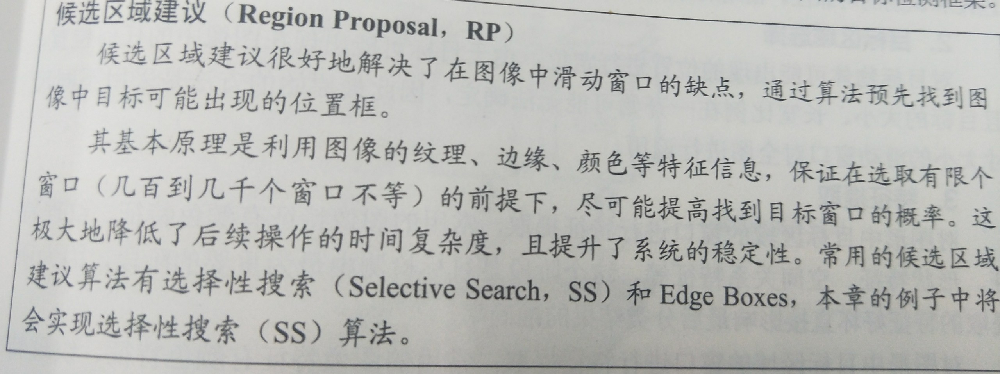
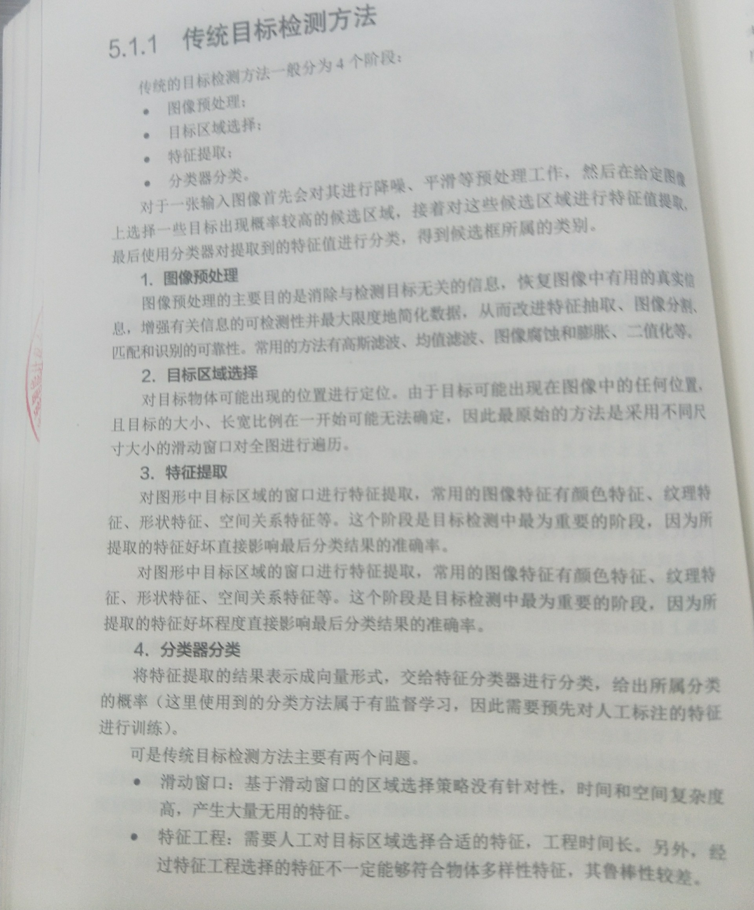
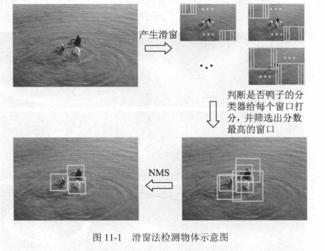
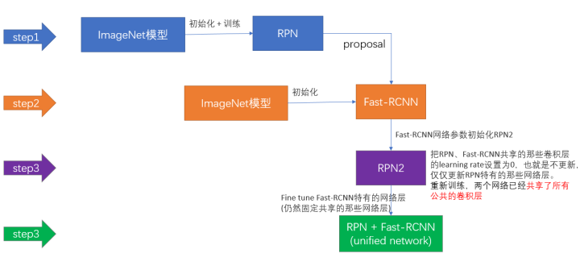
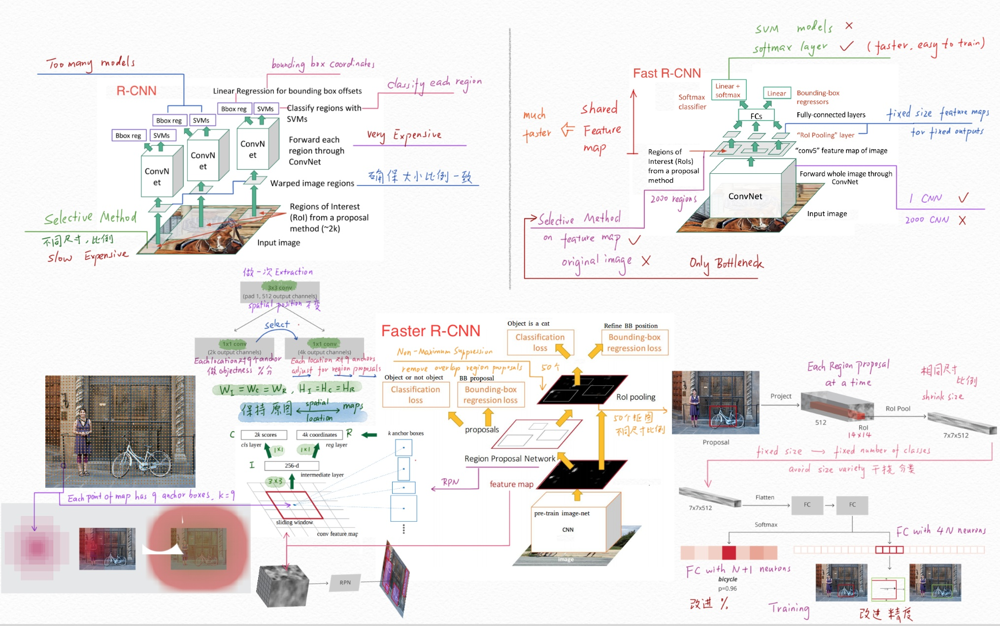

# 目标检测资源汇总

[目标检测模型的评估指标 mAP（Mean Average Precision） 详解(附代码）](https://zhuanlan.zhihu.com/p/37910324)

- 结合候选框建议（Region Proposal, RP）的框架：R-CNN、Fast R-CNN、Faster R-CNN
- 超实时的基于回归框架：YOLO、SSD

更多图片笔记见：[图片笔记](图片笔记.md)

## 1  主要文献

### 1.1  滑窗法

滑窗法（Sliding Window）的思路及其简单，首先需要已经训练好的一个分类器，然后把图片按照一定间隔和不同的大小分成一个个窗口，在这些窗口上执行分类器。如果得到较高的分数分类，就认为是检测到了物体。把每个窗口都用分类器执行一遍之后，再对得到的分数做一些后处理，如非极大值抑制（Non-Maximum Suppression，NMS）等，最后得到物体类别和对应区域。

滑窗法非常简单，但是效率低下，尤其是还要考虑物体的长宽比。如果执行比较耗时的分类器算法，用滑窗法就不太现实。常见的都是一些小型分类网络和滑窗法结合的应用，如论文《[Mitosis Detection in Breast Cancer Histology Images
with Deep Neural Networks](papers/滑窗法.pdf)[^1]》所做的检测胸切片图像中有丝分裂用于辅助癌症诊断。

[^1]: Ciresan D C, Giusti A, Gambardella L M, et al. Mitosis Detection in Breast Cancer Histology Images with Deep Neural Networks[C]. medical image computing and computer assisted intervention, 2013: 411-418.

### 1.2  非极大值抑制

- 论文：[Efficient Non-Maximum Suppression](papers/NMS.pdf)[^2]
- [解读](https://www.jianshu.com/p/325e3747fc56)
- [目标检测 - 非极大值抑制(Non Maximum Suppression)](https://blog.csdn.net/zziahgf/article/details/78525279)
- [nms.py](https://github.com/rbgirshick/fast-rcnn/blob/master/lib/utils/nms.py)

[^2]: Neubeck A, Van Gool L. Efficient Non-Maximum Suppression[C]. international conference on pattern recognition, 2006: 850-855.

### 1.3  选择性搜索

选择性搜索（Selective Search）是主要运用图像分割技术来进行物体检测。

#### 1.3.1 简介

Selective Search 属于传统机器学习的方法，在 Faster R-CNN 中被 RPN 所取代。

在较高层次上进行选择性搜索通过不同大小的窗口查看图像，并且对于每个尺寸，尝试通过纹理、颜色或强度将相邻像素组合在一起以标识对象。类似一个聚类的过程。在窗口的 size 更大的时候，相邻聚类尝试合并。最后把不同窗口大小下的不同聚类区块都提交作为 proposal。

- [Selective Search for Object Recognition](papers/UijlingsIJCV2013.pdf)[^3]
- [论文笔记《Selective Search for object recognition》](https://blog.csdn.net/niaolianjiulin/article/details/52950797)
- [[初窥目标检测]——《目标检测学习笔记（2）:浅析Selective Search论文——“Selective Search for object recognition”》](https://blog.csdn.net/u011478575/article/details/80041921)
- [Selective Search for Object Recognition解读](https://blog.csdn.net/mao_kun/article/details/50576003)

[^3]: Uijlings J R, De Sande K E, Gevers T, et al. Selective Search for Object Recognition[J]. International Journal of Computer Vision, 2013, 104(2): 154-171.

---------------------

- 输入：彩色图片（三通道）
- 输出：物体位置的可能结果 $L$
    1. 使用《Efficient Graph-Based Image Segmentation》方法，获取初始分割区域 $R=\{r_1,r_2, \ldots, r_n\}$
    2. 初始化相似度集合 $S=∅$
    3. 计算 $R$ 中两两相邻区域 $r_i, r_j$ 之间的相似度，将其添加到相似度集合 $S$ 中。
    4. 从相似度集合 $S$ 中找出，相似度最大的两个区域 $r_i$ 和 $r_j$，将其合并成为一个区域 $r_t$。然后从相似度集合中除去原先与 $r_i$ 和 $r_j$ 相邻区域之间计算的相似度。计算新的 $r_t$ 与其相邻区域（原先与 $r_i$ 或 $r_j$ 相邻的区域）的相似度，将其结果添加的到相似度集合 $S$ 中。同时将新区域 $r_t$ 添加到区域集合 $R$ 中。迭代直至 $S$ 为空，即可合并区域的都已合并完。区域的合并方式类似于哈夫曼树的构造过程，因此称之有**层次**（hierarchical）。
    5. 获取 $R$ 中每个区域的 Bounding Boxes，这个结果就是图像中物体可能位置的可能结果集合 $L$。

-------------

#### 1.3.2  解读

- [选择性搜索 Selective Search -- 算法详解+源码分析](https://blog.csdn.net/Tomxiaodai/article/details/81412354)
- [目标检测--Selective Search for Object Recognition(IJCV, 2013)](http://www.cnblogs.com/zhao441354231/p/5941190.html)
- 项目地址：http://disi.unitn.it/~uijlings/MyHomepage/index.php#page=projects1
- GitHub：https://github.com/CodeXZone/selectivesearch

### 1.4  R-CNN

- 论文：[Rich Feature Hierarchies for Accurate Object Detection and Semantic Segmentation](papers/R-CNN.pdf)[^4]
- [项目地址](http://www.cs.berkeley.edu/~rbg/slides/rcnn-cvpr14-slides.pdf): https://github.com/rbgirshick/rcnn (基于MATLAB)
- [R-CNN论文详解](https://blog.csdn.net/WoPawn/article/details/52133338?tdsourcetag=s_pcqq_aiomsg)
- [R-CNN论文翻译](http://www.cnblogs.com/pengsky2016/p/7921857.html)
- [R-CNN文章详细解读](https://www.jianshu.com/p/5056e6143ed5)

[^4]: Girshick R B, Donahue J, Darrell T, et al. Rich Feature Hierarchies for Accurate Object Detection and Semantic Segmentation[J]. computer vision and pattern recognition, 2014: 580-587.

R-CNN 方法结合了两个关键的因素：

1. 将大型卷积神经网络(CNNs)应用于自下而上的候选区域以定位和分割物体。
2. 当带标签的训练数据不足时，先针对辅助任务进行有监督预训练，再进行特定任务的调优，就可以产生明显的性能提升。

### 1.5  SPP

- 论文：[Spatial Pyramid Pooling in Deep Convolutional Networks for Visual Recognition](papers/SPPNETs.pdf)[^5]
- [SPPNet论文翻译-空间金字塔池化](http://www.dengfanxin.cn/?p=403)
- [原始图片中的ROI如何映射到到feature map?](https://zhuanlan.zhihu.com/p/24780433)
- [何凯明在ICCV2015上演讲的PPT](http://kaiminghe.com/iccv15tutorial/iccv2015_tutorial_convolutional_feature_maps_kaiminghe.pdf)
- [卷积神经网络物体检测之感受野大小计算](http://www.cnblogs.com/objectDetect/p/5947169.html)
- [RCNN学习笔记(3)](https://blog.csdn.net/u011534057/article/details/51219959)
- [SPP-net文章详细解读](https://www.jianshu.com/p/07a573035e43)

[^5]: He K, Zhang X, Ren S, et al. Spatial Pyramid Pooling in Deep Convolutional Networks for Visual Recognition[J]. IEEE Transactions on Pattern Analysis and Machine Intelligence, 2015, 37(9): 1904-1916.

### 1.6  Fast R-CNN

- 论文：[Fast R-CNN](papers/Fast_R-CNN.pdf)[^6]
- [Fast-RCNN论文翻译](http://www.dengfanxin.cn/?p=423)

为了通过判别训练来获得好的结果，往往需要使用大量训练样本。在目标检测中，训练问题是非常不平衡的，因为相比于特定目标来说有更大量的未知的背景。这就需要我们通过搜索背景数据来找到一个相对少量的潜在的误报(虚警)的负样本集，或者叫做难例(负样本难例，Hard Negative Example)

#### 1.6.1 相关资料

HOG(Histogram of Oriented Gradient, [最为经典的论文](https://hal.inria.fr/file/index/docid/548512/filename/hog_cvpr2005.pdf)[^17]、[较为详细的论文](https://hal.inria.fr/tel-00390303/)[^18])是2005年CVPR会议上，法国国家计算机科学及自动控制研究所的Dalal等人提出的一种解决人体目标检测的图像描述子，该方法使用梯度方向直方图（Histogram of Oriented Gradients,简称HOG）特征来表达人体，提取人体的外形信息和运动信息，形成丰富的特征集。

[^17]: Dalal N, Triggs B. Histograms of oriented gradients for human detection[C]. computer vision and pattern recognition, 2005: 886-893.
[^18]: Dalal N. Finding people in images and videos[D]. Institut National Polytechnique de Grenoble-INPG, 2006.

- 论文[DPM(Deformable Part Model)](papers/lsvm-pami.pdf)[^16]
- 论文翻译 [使用判别训练的部件模型进行目标检测](https://blog.csdn.net/masibuaa/article/details/17924671)
- [DPM目标检测算法(毕业论文节选)](https://blog.csdn.net/ttransposition/article/details/41806601)
- [HOG特征（Histogram of Gradient）学习总结](https://blog.csdn.net/u011285477/article/details/50974230)
- [HOG特征（毕业论文节选）](https://blog.csdn.net/ttransposition/article/details/41805767)

[^6]: Girshick R B. Fast R-CNN[J]. international conference on computer vision, 2015: 1440-1448.
[^16]: ] P. Felzenszwalb, R. Girshick, D. McAllester, and D. Ramanan. Object detection with discriminatively trained part based models. TPAMI, 2010

### 1.7  Faster R-CNN

**其实 RPN 最终就是在原图尺度上，设置了密密麻麻的候选 Anchor。然后用cnn去判断哪些Anchor是里面有目标的 foreground anchor，哪些是没目标的 backgroud。所以，仅仅是个二分类而已！**

四步交替训练：

[^8]: Ren S, He K, Girshick R B, et al. Faster R-CNN: Towards Real-Time Object Detection with Region Proposal Networks[J]. IEEE Transactions on Pattern Analysis and Machine Intelligence, 2017, 39(6): 1137-1149.

- 论文：[Faster R-CNN: Towards Real-Time Object Detection with Region Proposal Networks](papers/Faster_R-CNN_2017.pdf)[^8]
- [Faster R-CNN论文翻译](https://www.jianshu.com/p/7adc34483e4a)
- [视频：锚框解读](https://www.bilibili.com/video/av29987414)
- [Faster-RCNN论文细节原理解读+代码实现gluoncv(MXNet)](https://blog.csdn.net/XiangJiaoJun_/article/details/85008477)
- [Faster R-CNN论文及源码解读](https://senitco.github.io/2017/09/02/faster-rcnn/)(推荐)
- [图解Faster R-CNN简单流程](https://zhuanlan.zhihu.com/p/35481542)(推荐)
- [Faster R-CNN](https://zhuanlan.zhihu.com/p/24916624)
- [目标检测 - Faster R-CNN 详解](https://www.aiuai.cn/aifarm192.html)(推荐)
- [R-CNN系列论文解读](https://zhuanlan.zhihu.com/p/38279984)
- [一文读懂 Faster RCNN](https://zhuanlan.zhihu.com/p/31426458)(推荐)
- [从编程实现角度学习Faster R-CNN（附极简实现）](https://zhuanlan.zhihu.com/p/32404424)(推荐)
- [Faster R-CNN: Down the rabbit hole of modern object detection](https://tryolabs.com/blog/2018/01/18/faster-r-cnn-down-the-rabbit-hole-of-modern-object-detection/)
- [一文教你如何用PyTorch构建 Faster RCNN](https://zhuanlan.zhihu.com/p/56710152)
- [边框回归(Bounding Box Regression)详解](https://blog.csdn.net/zijin0802034/article/details/77685438?tdsourcetag=s_pcqq_aiomsg)

### 1.8  Mask R-CNN

- 论文1：[Even faster sorting of (not only) integers](papers/1703.00687.pdf)[^9]
- [视频解读](https://www.bilibili.com/video/av24795835/?spm_id_from=333.788.videocard.1)
- 论文2：[MaskR-CNN](papers/Mask-R-CNN.pdf)[^10]

[^9]: Kokot M, Deorowicz S, Dlugosz M, et al. Even Faster Sorting of (Not Only) Integers[J]. arXiv: Data Structures and Algorithms, 2017: 481-491.

[^10]: He K, Gkioxari G, Dollar P, et al. Mask R-CNN[J]. international conference on computer vision, 2017: 2980-2988.

### 1.9  YOLO

- 论文1：[You Only Look Once: Unified, Real-Time Object Detection](papers/YOLO.pdf)[^11]
- 论文2：[YOLO9000: Better, Faster, Stronger](papers/YOLO9000.pdf)[^12]
- 论文3：[YOLOv3: An Incremental Improvement](papers/YOLOv3.pdf)[^13]

[^11]: Redmon J, Divvala S K, Girshick R B, et al. You Only Look Once: Unified, Real-Time Object Detection[J]. computer vision and pattern recognition, 2016: 779-788.

[^12]: Redmon J, Farhadi A. YOLO9000: Better, Faster, Stronger[J]. computer vision and pattern recognition, 2017: 6517-6525.

[^13]: Redmon J, Farhadi A. YOLOv3: An Incremental Improvement.[J]. arXiv: Computer Vision and Pattern Recognition, 2018.

- [YOLO论文翻译——中英文对照](https://www.jianshu.com/p/a2a22b0c4742?utm_campaign=maleskine)
- [YOLO详解](https://zhuanlan.zhihu.com/p/25236464)
- [目标检测|YOLO原理与实现](https://zhuanlan.zhihu.com/p/32525231)

### 1.10  SSD

- 论文：[SSD: Single Shot MultiBox Detector](papers/1512.02325v5.pdf)[^14]
- [Single Shot MultiBox Detector论文翻译——中文版](https://www.jianshu.com/p/467419cf94dd?utm_campaign=maleskine)
- [目标检测|SSD原理与实现](https://zhuanlan.zhihu.com/p/33544892?tdsourcetag=s_pcqq_aiomsg)
- [a-PyTorch-Tutorial-to-Object-Detection](https://github.com/sgrvinod/a-PyTorch-Tutorial-to-Object-Detection)
- [卷积神经网络的感受野](https://zhuanlan.zhihu.com/p/44106492)
- [解读SSD目标检测方法](https://www.jianshu.com/p/0903b160d554)
- [faster rcnn中rpn的anchor，sliding windows，proposals？](https://www.zhihu.com/question/42205480)
- [Object Detections中Anchors的那些事](https://zhuanlan.zhihu.com/p/42314266)
- [a-PyTorch-Tutorial-to-Object-Detection](https://github.com/sgrvinod/a-PyTorch-Tutorial-to-Object-Detection)

[^14]: Liu W, Anguelov D, Erhan D, et al. SSD: Single Shot MultiBox Detector[J]. european conference on computer vision, 2016: 21-37

### 1.11  A Survey

- [Deep Learning for Generic Object Detection: A Survey](papers/1809.02165.pdf)[^15]
- [深度学习目标检测模型全面综述：Faster R-CNN、R-FCN和SSD](https://zhuanlan.zhihu.com/p/29434605)
- [Object Detection with Deep Learning: The Definitive Guide](https://tryolabs.com/blog/2017/08/30/object-detection-an-overview-in-the-age-of-deep-learning/)
- [ECCV2018目标检测（object detection）算法总览](https://blog.csdn.net/u014380165/article/details/82025720)
- [目标检测(Object Detection)的整理](https://blog.csdn.net/mdjxy63/article/details/79344045)
- [CVPR2019目标检测方法进展综述](https://blog.csdn.net/SIGAI_CSDN/article/details/88687747)

[^15]: Liu L, Ouyang W, Wang X, et al. Deep Learning for Generic Object Detection: A Survey.[J]. arXiv: Computer Vision and Pattern Recognition, 2018.

## 2 学习资源

- [Grid R-CNN解读：商汤最新目标检测算法](https://www.52cv.net/?p=1800)
- [Grid R-CNN 论文](papers/Grid_R-CNN.pdf)
- [计算机视觉研究入门全指南](https://www.52cv.net/?p=524)
- [经典CNN结构简析：AlexNet、VGG、NIN、GoogLeNet、ResNet etc.](https://zhuanlan.zhihu.com/p/47391705)
- [从RCNN到SSD，这应该是最全的一份目标检测算法盘点](https://zhuanlan.zhihu.com/p/36184131)
- [R-CNN、Fast/Faster/Mask R-CNN、FCN、RFCN 、SSD原理简析](https://zhuanlan.zhihu.com/p/47579399)